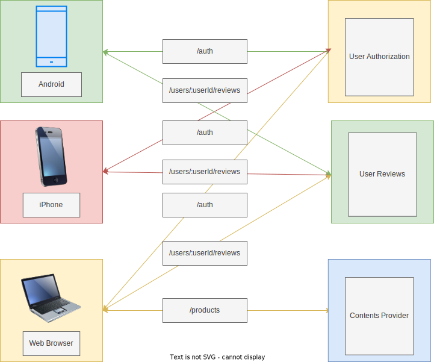
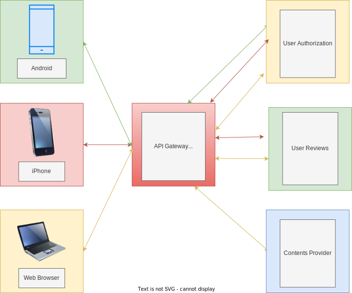
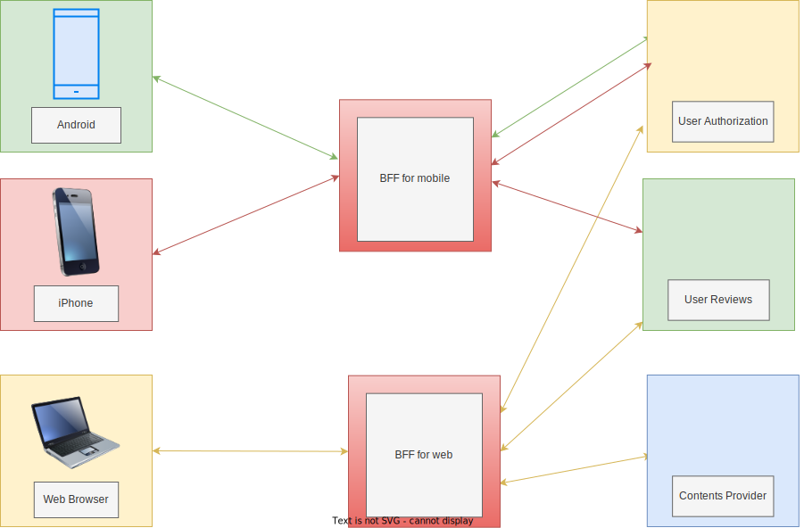

- [What is GraphQL?](#what-is-graphql)
- [Why to use? Learn the history](#why-to-use-learn-the-history)
- [Demo App](#demo-app)

# What is GraphQL?

**GraphQL is not brand new technology, it's just a API specification.**

From where I sit, GraphQL is a specification for enhancing `schema driven`, `data driven` development.

1. schema driven

    `schema driven` developing enables us to maintain and enhance features more easily when systems are complicated. It's like OpenAPI schema for REST API.

2. data driven

    `data driven` developing tells and forces us what the frontend really needs. Clients can get data only what they actually need. In Rest API, they might've gotten extra data what they really don't need.


-   Basic features

| name          | description                                                                                    |
| ------------- | ---------------------------------------------------------------------------------------------- |
| schemas       | data schema                                                                                    |
| queries       | Client fetches data through queries                                                            |
| mutations     | Client update data through mutations                                                           |
| subscriptions | They can maintain an active connection to your GraphQL server, most commonly using `WebSocket` |

[More info. See official document](https://graphql.org/learn/)

# Why to use? Learn the history

-   Multiple client Web/Business Application

    

-   API Gateway Pattern

    -   For All Clients

        Features:

        -   API Gateway is kinda broker which connects Frontend to Backend Services.
        -   API Gateway doesn't distinguish client types, as shown below, except for the pattern which distinguishes the Frontend client by its paths.

        

        Cons:

        -   Basically we can't get data which crosses multiple services with one request. So after we might have to keep on requesting to get all data we need.

    -   Backend for Front End Pattern aka BFF

        Features:

        -   Frontend is able to get multiple data with only one request. it doesn't need to couple times.
        -   BFF handles with each requests and responses specialized for each frontend.

        

        Cons:

        -   Increase the risk of Single Point of Failure
        -   The bigger system will be, the more BFF will be complicated and difficult to maintain, difficult to expand the feature

**[more info in terms of microservice](https://microservices.io/patterns/apigateway.html)**

-   Compares GraphQL to REST API

| GraphQL                                                     | REST API                                                |
| ----------------------------------------------------------- | ------------------------------------------------------- |
| Only POST method, response code is alway 200.               | Each request path, method, query/path parameter, body,  |
| Only changing request body leads to get/update several data | header, response status code and whatnot are different. |

# Demo App

**Make sure that you've already installed Node.js V18.12.1 or newer and yarn V1.22 or newer**

-   If not yet, Just run the following script

    -   `nvm` works on any POSIX client including MacOS, Windows Subsystem for Linux 1/2 or whatnot.
    -   Command line shell is limited to `Bash` on this shellscript. If you use another shell like `zsh`, rewrite the script on the part of `~/.bashrc`.

```bash
#!/usr/bin/env bash

cd ~
curl -o- https://raw.githubusercontent.com/nvm-sh/nvm/v0.39.1/install.sh | bash
. ~/.bashrc

nvm install v18.12.1

npm install -g yarn@1.22.18
echo -e "\n# Node.js" >> ~/.bashrc
echo 'export NODE_PATH=$(npm root -g)' >> ~/.bashrc
```

1. clone this repository

```sh
git clone https://github.com/Yo-mah-Ya/graphql-demo.git
```

2. install libraries

```sh
yarn install
```

3. start Apollo Server

```sh
yarn start
```

After you start Apollo server, just access to **localhost:3000** on a web browser.
And paste a query and variables on web console shown below.

query

```graphql
query allPeople($first: Int!, $filmConnectionFirst: Int!, $after: String) {
    allPeople(first: $first, after: $after) {
        pageInfo {
            hasNextPage
            endCursor
        }
        totalCount
        edges {
            cursor
            node {
                ...PrimitivesOfPerson
                filmConnection(first: $filmConnectionFirst) {
                    pageInfo {
                        hasNextPage
                        endCursor
                    }
                    totalCount
                    edges {
                        node {
                            ...PrimitivesOfFilm
                        }
                        cursor
                    }
                    nodes {
                        ...PrimitivesOfFilm
                    }
                }
            }
        }
        nodes {
            ...PrimitivesOfPerson
            filmConnection(first: $filmConnectionFirst) {
                pageInfo {
                    hasNextPage
                    endCursor
                }
                totalCount
                edges {
                    cursor
                    node {
                        ...PrimitivesOfFilm
                    }
                }
                nodes {
                    ...PrimitivesOfFilm
                }
            }
        }
    }
}
fragment PrimitivesOfPerson on Person {
    id
    name
}
fragment PrimitivesOfFilm on Film {
    id
    title
    episodeId
    director
}
```

variables

```json
{
    "first": 3,
    "filmConnectionFirst": 10,
    "after": "9"
}
```

1. execute sample test

```sh
# execute an example resolver test
yarn test src/resolvers/people/resolver.test.ts
# or execute all tests
yarn test
```
